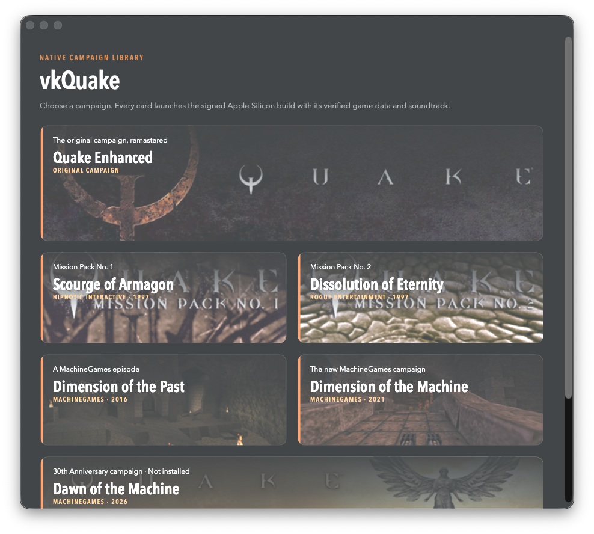
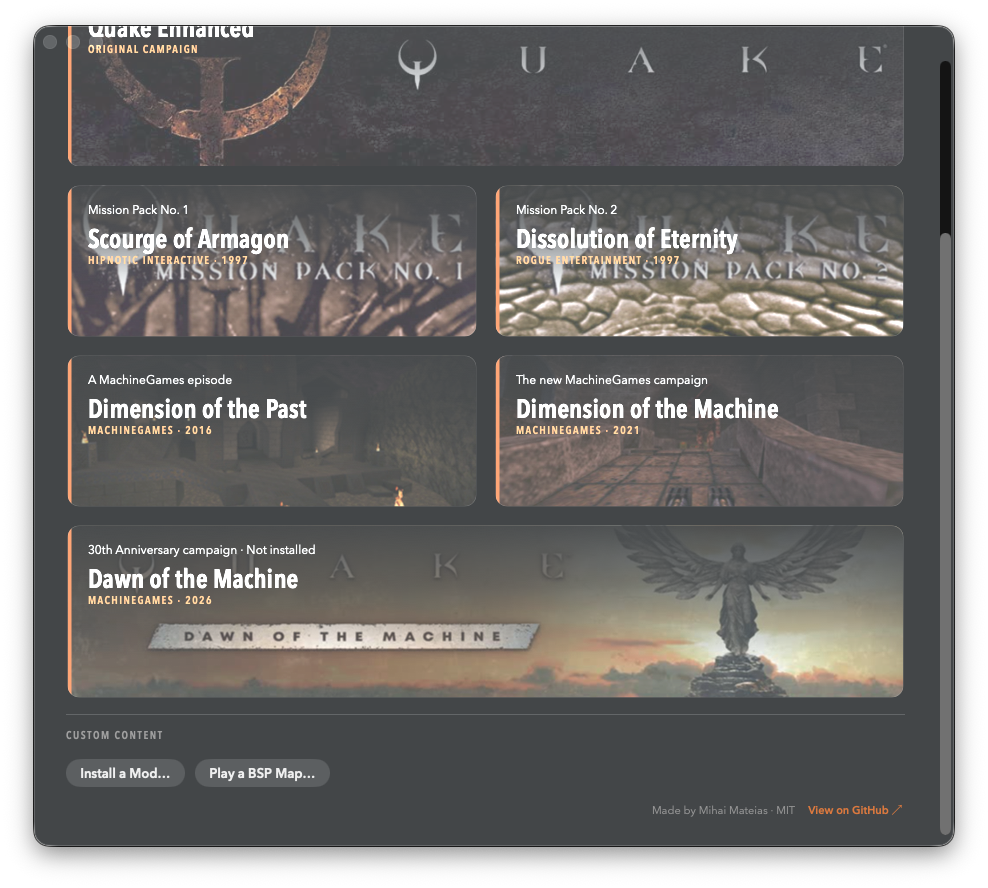

# vkQuake Launcher

A native macOS campaign launcher for [vkQuake](https://github.com/Novum/vkQuake). It provides one-click campaign selection, official shareware detection, custom mod installation, loose BSP map launching, and clear diagnostics when engine or game data is missing.

Made by **Mihai Mateias** and released under the [MIT License](LICENSE).





## Download and install

1. Download `vkQuake-Launcher.dmg` from the [latest release](https://github.com/cefege/vkquake-launcher/releases/latest).
2. Open the DMG.
3. Copy `vkQuake Launcher.app` into your Quake folder **beside** the `rerelease` folder. Do not put it inside `rerelease` or `/Applications`.
4. Double-click `vkQuake Launcher.app`. If macOS blocks the ad-hoc signed build, Control-click it, choose **Open**, then confirm **Open**.
5. Choose an installed campaign card.

## Runtime requirements

- macOS 11 or newer
- A lawful vkQuake installation and Quake game data

The launcher does **not** include vkQuake, Quake game data, or campaign files.

## Expected installation layout

```text
Quake/
├── vkQuake Launcher.app
└── rerelease/
    ├── vkQuake.app
    ├── quakeex.kpf
    ├── id1/
    ├── hipnotic/
    ├── rogue/
    ├── dopa/
    └── mg1/
```

The launcher resolves this layout relative to its own location, so the complete `Quake` folder can be moved without breaking hard-coded paths.

## Use the launcher

- **Campaigns:** Click any installed campaign card. The launcher verifies the required data before starting vkQuake with the correct arguments.
- **Official demo:** A shareware installation containing only `id1/pak0.pak` is identified as **Quake Shareware** and launches Episode One.
- **Mods:** Click **Install a Mod…**, select an extracted mod folder containing a PAK, PK3, PK4, `progs.dat`, or BSP, then choose **Install and Play**. Reserved official directories are never overwritten.
- **Loose maps:** Click **Play a BSP Map…** and select a valid Quake BSP29 or BSP2 file. The launcher installs it under `rerelease/custom/maps` and starts the map.
- **Dawn of the Machine:** The card is informational until the official `mg3` data reaches your game library and a Dawn-capable vkQuake build is installed and verified.
- **Project page:** Click **View on GitHub ↗** in the lower-right corner of the launcher.

## Build

Building from source also requires the Xcode Command Line Tools (`swiftc`).

```bash
./build-app.sh
```

The unsigned development build is written to `build/vkQuake Launcher.app` and then ad-hoc signed.

Campaign preview images are included in `Resources/` so source builds retain the illustrated campaign cards. These Quake promotional images are not covered by the MIT License; all artwork rights remain with their respective owners. See [NOTICE](NOTICE) for sources and attribution.

An optional `Resources/vkquake.icns` supplies the application icon.

## Safety behavior

- Missing engine and campaign files produce actionable warnings instead of crashes.
- An official shareware installation is detected when `id1/pak0.pak` exists without registered or enhanced data.
- Official campaign, engine, and custom-map directories cannot be overwritten by mod installation.
- Loose maps must have a Quake BSP29 or BSP2 header and a safe map name.
- Choosing an already-installed BSP launches it without deleting the source file.
- A second campaign is not launched while vkQuake is already running.
- Dawn of the Machine remains informational until lawful `mg3` data and a Dawn-capable vkQuake build are available and verified.

## Bug reports

Report bugs at <https://github.com/cefege/vkquake-launcher/issues>.

Include your macOS version, vkQuake version, selected campaign or custom content, and the exact warning shown by the launcher. Do not upload copyrighted game data.
